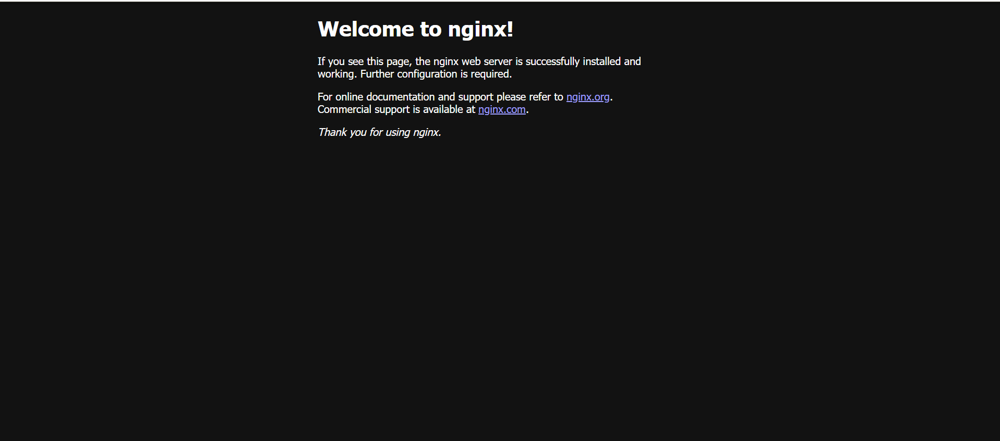
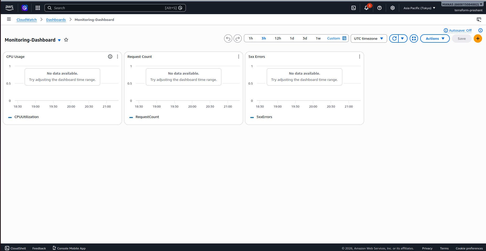
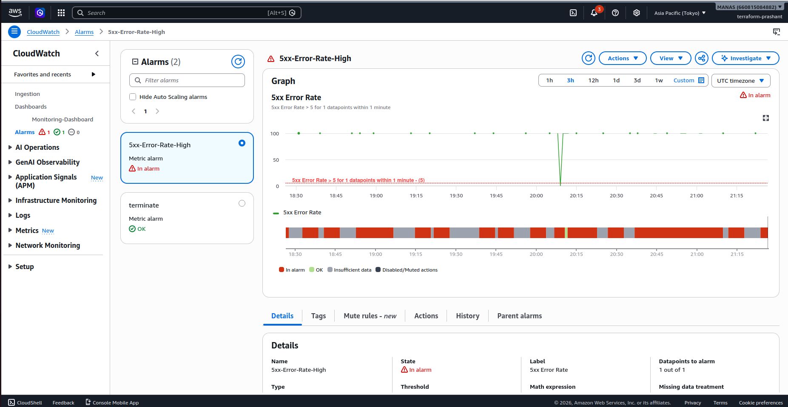
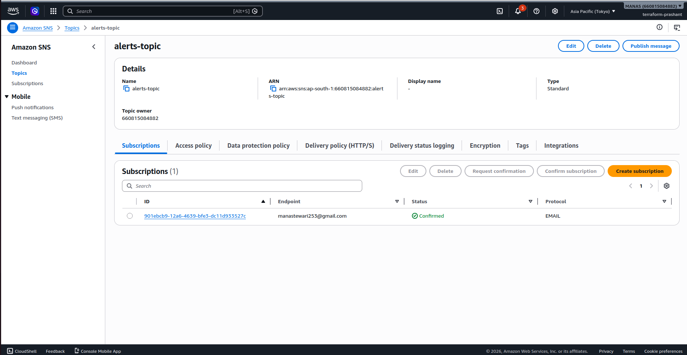

# Define the content of the README.md
readme_content = """# AWS Nginx Infrastructure with Automated Monitoring

This repository contains the configuration and documentation for a high-performance **Nginx** web server deployment on AWS. The setup includes a comprehensive observability stack using **Amazon CloudWatch** and **Amazon SNS** to ensure high availability and rapid incident response.

## 🚀 System Architecture

The infrastructure is designed to provide a "Welcome to nginx!" landing page as a baseline service, with integrated monitoring layers.

### 1. Web Service
The core service is an Nginx web server. Successful deployment is verified by the default Nginx welcome page.

### 2. Monitoring Dashboard
A centralized **CloudWatch Dashboard** (named `Monitoring-Dashboard`) provides real-time visualization of system health:
*   **CPU Usage**: Monitoring instance-level performance.
*   **Request Count**: Tracking traffic throughput.
*   **5xx Errors**: Identifying server-side failures.

### 3. Alerting & Notifications
To ensure rapid response, the system utilizes **CloudWatch Alarms** integrated with **Amazon SNS**.

*   **Alarm Name**: `5xx-Error-Rate-High`
*   **Condition**: Triggers when 5xx Error Rate > 5 for 1 datapoint within 1 minute.
*   **Topic**: `alerts-topic`
*   **Notification Method**: Email (Confirmed subscription for manastewari253@gmail.com).

## 🛠 Features

*   **Infrastructure as Code**: Managed via Terraform (as indicated by the `terraform-prashant` environment).
*   **Automated Observability**: Dashboards and alarms are provisioned alongside the compute resources.
*   **Immediate Alerting**: Email notifications for critical server errors (5xx).

## 📋 Usage Instructions

1.  **Deployment**: Run your Terraform deployment scripts to provision the EC2 instance, SNS topics, and CloudWatch metrics.
2.  **Verification**:
    *   Navigate to the public IP to see the Nginx welcome page.
    *   Visit the AWS CloudWatch console to view the `Monitoring-Dashboard`.
3.  **Testing Alarms**: Simulate 5xx errors to verify that the `5xx-Error-Rate-High` alarm transitions to the `In alarm` state and sends an email via SNS.

## 📁 Referenced Assets
*   `Pasted image.png`: Proof of Nginx installation.
*   `Screenshot from 2026-04-30 02-55-49.png`: CloudWatch Dashboard overview.
*   `Screenshot from 2026-04-30 02-57-00.png`: Details of the 5xx Error Rate alarm.
*   `Screenshot from 2026-04-30 02-57-55.png`: SNS Topic and Subscription details.
"""

# Save to a file
with open("README.md", "w") as f:
    f.write(readme_content)